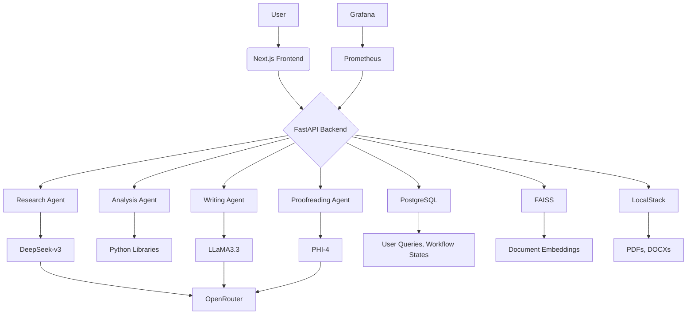

# 🧠 Multi-Agent Research System


[](https://choosealicense.com/licenses/mit/)
[](https://github.com/ankitsharma-tech)

## 📑 Table of Contents

- [🧠 Multi-Agent Research System](#-multi-agent-research-system)
  - [📑 Table of Contents](#-table-of-contents)
  - [🌟 Overview](#-overview)
  - [🚀 Getting Started](#-getting-started)
  - [✨ Features](#-features)
  - [🗂️ Project Structure](#️-project-structure)
    - [Mermaid Diagram](#mermaid-diagram)
    - [File Tree](#file-tree)
  - [🛠 Tech Stack](#-tech-stack)
  - [🤝 Contributing](#-contributing)
  - [📄 License](#-license)

## 🌟 Overview

The **Multi-Agent Research System** is a cutting-edge platform designed to revolutionize research by leveraging the power of multiple AI agents. This system allows users to input research topics, and then utilizes a team of specialized agents, orchestrated by LangChain and OpenRouter, to perform in-depth research, analysis, and report generation. The system is built with a modern web development stack, featuring a Next.js frontend and a FastAPI backend.

## 🚀 Getting Started

1. **Clone the repository:**

   ```bash
   git clone https://github.com/ankitsharma-tech/Multi-Agent-Research-System.git
   cd Multi-Agent-Research-System
   ```

2. **Install dependencies:**

   - Make sure you have pnpm installed:

   ```bash
   npm install -g pnpm
   ```

   - Then, install project dependencies

   ```bash
   pnpm install
   ```

3. **Run both frontend and backend:**

   ```bash
   pnpm run frontend
   pnpm run backend
   ```

4. **Open your browser** and navigate to `http://localhost:3000` for the frontend. The backend will typically run on port 8000.

## ✨ Features

- **🤖 Multi-Agent System:** Utilizes multiple AI agents, each specialized in tasks like research, analysis, writing, and proofreading.
- **🧠 Advanced AI Models:** Integrates with powerful language models, including DeepSeek-v3, LLaMA3.3-70B-Instruct, GPT-4o, and PHI-4 via OpenRouter.
- **📝 Research Topic Submission:** User-friendly interface for submitting research topics and queries.
- **🔄 Real-time Progress Updates:** Displays real-time updates on the progress of the multi-agent workflow using WebSockets or polling.
- **📊 Data Visualization:** Provides a dashboard to visualize agent outputs and workflow stages.
- **📄 Report Generation:** Automatically generates structured research reports based on agent findings.
- **📥 Report Download:** Allows users to download reports in PDF or DOCX formats.
- **🗃️ Data Storage:** Stores data locally using PostgreSQL and FAISS, with scalability for future AWS deployment.
- **🔍 Monitoring:** Employs Prometheus and Grafana for system performance monitoring.

## 🗂️ Project Structure

### Mermaid Diagram



### File Tree

```markdown
multi-agent-research-system/
├── .gitignore
├── pnpm-lock.yaml
├── pnpm-workspace.yaml
├── package.json (Root)
├── backend/
│ ├── main.py
│ ├── requirements.txt
│ ├── venv/
│ └── ...
└── frontend/
├── app/
│ ├── about/
│ │ └── page.tsx
│ ├── api/
│ │ └── feedback/
│ │ └── route.ts
│ ├── error.tsx
│ ├── feedback/
│ │ └── page.tsx
│ ├── globals.css
│ ├── layout.tsx
│ └── page.tsx
├── components/
│ ├── forms/
│ │ ├── feedback-form.tsx
│ │ └── research-topic-form.tsx
│ ├── layout/
│ │ ├── footer.tsx
│ │ ├── header.tsx
│ │ └── success-message.tsx
│ ├── pages/
│ │ ├── about-page.tsx
│ │ ├── feedback-page.tsx
│ │ └── home-page.tsx
│ ├── sections/
│ │ ├── cta-section.tsx
│ │ ├── feature-card.tsx
│ │ └── hero-section.tsx
│ ├── theme-provider.tsx
│ └── ui/
│ ├── ... (ShadCN-UI components)
├── hooks/
│ └── use-toast.ts
├── lib/
│ ├── schemas.ts
│ └── utils.ts
├── public/
├── .eslintrc.json
├── components.json
├── next.config.js
├── package.json (Frontend)
├── postcss.config.js
├── tailwind.config.ts
└── tsconfig.json
```

## 🛠 Tech Stack

- **Frontend:**
  - **Framework:** [Next.js](https://nextjs.org/)
  - **Language:** TypeScript
  - **Styling:** [Tailwind CSS](https://tailwindcss.com/)
  - **UI Components:** [shadcn-ui](https://ui.shadcn.com/)
  - **State Management:** React Context API or Zustand
- **Backend:**
  - **Framework:** [FastAPI](https://fastapi.tiangolo.com/)
  - **Agent Orchestration:** [LangChain](https://www.langchain.com/)
  - **Asynchronous Tasks:** Celery or Ray
  - **Web Server:** Uvicorn
- **Database:**
  - **Primary Database:** [PostgreSQL](https://www.postgresql.org/)
  - **ORM:** SQLAlchemy
  - **Vector Storage:** FAISS (Local), Pinecone/Weaviate (Future)
- **LLM Integration:**
  - **API Gateway:** [OpenRouter](https://openrouter.ai/)
  - **Models:**
    - DeepSeek-v3 (Retrieval, Summarization)
    - LLaMA3.3-70B-Instruct (Report Generation)
    - GPT-4o (Reasoning, Hypothesis Generation)
    - PHI-4 (Proofreading, Grammar)
- **Monitoring:**
  - **Metrics:** [Prometheus](https://prometheus.io/)
  - **Visualization:** [Grafana](https://grafana.com/)
- **File Storage:**
  - **Local:** [LocalStack](https://localstack.cloud/) (AWS S3 Emulation)
  - **Cloud (Future):** AWS S3
- **Caching:**
  - **In-Memory Cache:** Redis (Future)
- **Package Manager:** pnpm

## 🤝 Contributing

Contributions are welcome! Please feel free to submit a Pull Request.

1. Fork the repository
2. Create your feature branch (`git checkout -b feat/version/AmazingFeature`)
3. Commit your changes (`git commit -m 'Add some AmazingFeature'`)
4. Push to the branch (`git push origin feat/version/AmazingFeature`)
5. Open a Pull Request

AWS-certified Solutions Architect, Developer, SysOps Administrator, and Machine Learning Engineer with expertise in cloud architecture and modern development practices. Connect with me on:

- [GitHub](https://github.com/BjornMelin)

## 📄 License

This project is licensed under the MIT License - see the [LICENSE](LICENSE) file for details.